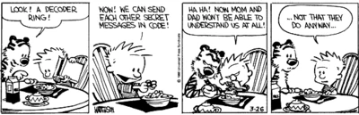

## Secret Cipher 2: The Caesar Cipher

This exercise builds on the last secret cipher exercise, but now it gets a little more complicated. This time we'll be using the Caesar cipher, which you may be familiar with if you've ever gotten a secret decoder ring as a prize in a cereal box.

The Caesar cipher takes an integer between 1-25 as a key. Each letter of the alphabet is assigned a position to match its index ('a' is 0, 'b' is 1, etc.). The key is added to the index value, and each letter in the secret message is replaced by the letter at the new index value. An example will make this clearer:

Let's say your secret message is 'abc', and your key is 2. The index values of the letters in your original message are 0,1, and 2, respectively. If you add 2 to each, the new index values are 2,3,4. If you refer to the letters of the alphabet at the index values of 2,3,4, you get 'cde'. So that's your encrypted message.

One challenge here is handling wraparound. If the key plus the letter index is more than 25, you'll need a way to start at the beginning of the alphabet again. For instance, if your original message is 'xyz', you're starting with the index values '23,24,25'. If your key is 2, this shifts them to '25,26,27'. But there are no letters with an alphabet index of 26 or 27! So in order to encrypt you'll need to circle back to the start, giving you the letters at indexes '25,1,2', or 'zab'.

Remember that your code should account for spaces, capital vs lowercase letters, punctuation, and other special characters. You can decide how you want to handle these.

You should be able to take an input file, like last time, and write the encrypted message to a new output file. Also, have a way to decrypt your messages after you encrypt them.

There are, again, a lot of different ways to solve this challenge. 